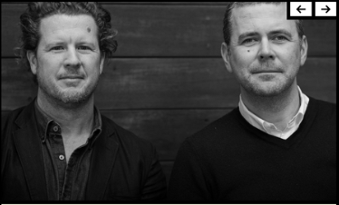

# GRID - CSS

### AIM :
        To Create a Web-Layout using Grid BOX Assignment

### ALGORITHM :
	
	       Step 1: Start by creating a new folder. 
	       Step 2: Create and Open the “index.html”, write the code.
	       Step 3: Create a new CSS file “style.css” 
	       Step 4: Design the basic structure of your website using HTML tags like <header>,      
                        <nav>, <main>, and <footer>.
         Step 5: Implement navigation menus using HTML lists (<ul> or <ol>) and CSS                                                   
             styling.
	       Step 6: Test your website by opening the HTML file in a web browser. Make any  
                        necessary adjustments to the HTML and CSS code to achieve the desired   
                        layout and design.
                        
### PROGRAM:
      
     index.html
            <!DOCTYPE html>
             <html lang="en">
             <head>
             <meta charset="UTF-8" />
             <meta http-equiv="X-UA-Compatible" content="IE=edge" />
             <meta name="viewport" content="width=device-width, initial-scale=1.0" />
             <title>Design Grid</title>
             <link rel="stylesheet" href="assets/css/style.css" />

             <link rel="preconnect" href="https://fonts.googleapis.com" />
             <link
             href="https://fonts.googleapis.com/css2?family=Montserrat&family=Poppins:wght@300;400;500;600;700;900&display=swap"
             rel="stylesheet"  />
              
              </head>
              <body>
             <header>
              <ul>
              <li>The Book</li>
             <li>Author</li>
              <li>Press</li>
              <li>Event</li>
              <li>Shop</li>
              <li>Contact</li>
             <li>Podcasts</li>
              </ul>
              </header>
              <section>
              

              <h2 class="design">DESIGN</h2>
               <h2 class="your">YOUR</h2>
                <h2 class="life">LIFE</h2>
                

               

               <h4><u>Upcoming Podcast</u></h4>
               <h1>Deborah Bibby</h1>
              

              

             
             

             </section>
             <aside>
            

              <u>The Book </u>
            

          
        

      

      

        Synopsis
        <h2>Applying Design Principles to your life.</h2>
      

      

        <u>Author</u>
        <h1>Vince Frost*</h1>
      

      

        
<i class="fa fa-envelope"></i>

        
<i class="fa fa-twitter"></i>

        
Shop

        
<i class="fa fa-linkedin-square"></i>

        
<i class="fa fa-pinterest-p"></i>

      

    </aside>
    <footer>
      
Desiging Well Being with Kerry Hill Architects

      
View the latest events

    </footer>
       </body>
       </html>
   
      style.css
             * { font-family: "Poppins", sans-serif}
              body {
              height: 97vh;
              display: grid;
              grid-template-columns: 50% 50%;
              grid-template-rows: 10% 82% 10%;
            }
            header {
              display: flex;
              justify-content: flex-start;
              align-items: center;
              grid-column: 1/3;
              border: solid 5px black;
              border-bottom: 0;
            }
            header ul {
              padding-left: 10px;
            }
            header ul li {
              background-color: white;
              display: inline-block;
              list-style: none;
              padding: 8px;
              font-weight: bold;
            }
            section {
              display: grid;
              grid-template-columns: 50% 50%;
              grid-template-rows: 30% 70%;
              border: solid 5px black;
              background-color: #f6f0e0;
              border-bottom: 0;
            }
            section div h1 {
              display: flex;
              justify-content: flex-start;
              align-items: center;
              /* width: 50%; */
              font-size: 40px;
              margin: 0;
            }
            section div img {
              object-fit: fill;
            }
            .images {
              background-image: url("assets/img/author.img");
              background-size: cover;
              grid-column: 1/3;
            }
            .title {
              display: flex;
              flex-direction: column;
              text-align: center;
              justify-content: center;
              overflow: hidden;
              margin: 0;
              background-color: white;
              border-right: solid 5px black;
              border-bottom: solid 5px black;
              font-size: 25px;
              font-weight: 500;
              line-height: 0px;
            }
            section div h2 {
              margin: 6%;
            }
            .design {
              letter-spacing: 2px;
            }
            .your {
              letter-spacing: 8px;
            }
            .life {
              letter-spacing: 12px;
            }
            .podcast {
              border-bottom: solid 5px black;
              border-top: 0;
              border-left: 0;
              display: flex;
              flex-direction: column;
              align-items: center;
              justify-content: flex-start;
              overflow: hidden;
              line-height: 0;
            }
            .Main-image {
              grid-column: 1/3;
              object-fit: contain;
              overflow: hidden;
              display: flex;
              align-items: center;
              justify-content: center;
            }

            .Main-image img {
              width: 100%;
              height: 100%;
            }
            section div h1 {
              margin: 0;
              font-size: 32px;
              line-height: 260%;
            }

            aside {
              display: grid;
              grid-template-columns: 50% 50%;
              grid-template-rows: 50% 25% 25%;
              border: solid 5px black;
              background-color: #f5efdf;
              border-left: 0;
              border-bottom: 0;
            }
            aside div u {
              font-weight: bold;
            }
            .TheBook {
              display: flex;
              justify-content: flex-start;
              align-items: center;
              flex-direction: column;
              overflow: hidden;
              border-bottom: solid 5px black;
              grid-column: 1/3;
              line-height: 340%;
            }
            .Book-image {
              display: flex;
              justify-content: center;
              height: 70%;
              width: 100%;
            }

            .Synopsis {
              border-right: solid 5px black;
              grid-row: 2/4;
              display: flex;
              flex-direction: column;
              align-items: center;
              padding-top: 10px;
              font-weight: bold;
            }
            aside div span {
              text-decoration: underline;
              font-weight: bold;
            }
            .Synopsis h2 {
              display: flex;
              justify-content: flex-start;
              align-items: center;
              flex-direction: column;
              text-align: center;
              width: 80%;
              padding-top: 20px;
            }
            .Author {
              border-bottom: solid 5px black;
              display: flex;
              justify-content: flex-start;
              align-items: center;
              flex-direction: column;
              margin: 0;
              padding-top: 10px;
            }

            .Shop {
              display: grid;
              grid-template-columns: 25% 25% 50%;
              grid-template-rows: 50% 50%;
            }
            .ShopHeading {
              grid-column: 3/4;
              grid-row: 1/3;
            }
            aside div i {
              background-color: white;
            }
            .Eicon,
            .Ticon,
            .Licon,
            .Picon {
              display: flex;
              justify-content: center;
              align-items: center;
              background-color: white;
            }
            .Eicon {
              border-bottom: solid 5px black;
              border-right: solid 5px black;
            }
            .Ticon {
              border-bottom: solid 5px black;
              border-right: solid 5px black;
            }
            .Licon {
              border-right: solid 5px black;
            }
            .Picon {
              border-right: solid 5px black;
            }
            .SHeading {
              display: flex;
              justify-content: center;
              align-items: center;
              font-weight: bold;
              font-size: 25px;
            }
            footer {
              display: grid;
              grid-template-columns: 50% 50%;
              border: solid 5px black;
              grid-column: 1/3;
              background-color: #fcf5e3;
            }
            .Design {
              display: flex;
              border-right: solid 5px black;
              justify-content: center;
              align-items: center;
              font-weight: bold;
              font-size: 12px;
            }
            .View {
              display: flex;
              justify-content: center;
              align-items: center;
              font-weight: bold;
              font-size: 25px;
            }
              
### OUTPUT :
            
   
            
### RESULT :
          Thus, the HTML & CSS program to Create a Web-Layout using Grid BOX has been created and executed successfully.

